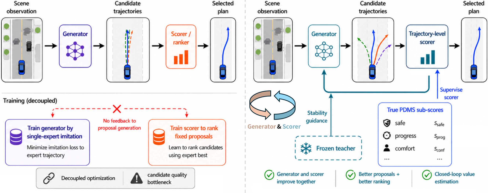

# CLOVER

<p align="center">
  
</p>

End-to-end autonomous driving planners are commonly trained by imitating a single logged trajectory, yet they are evaluated by rule-based planning metrics that measure safety, feasibility, progress, and comfort. This creates a training-evaluation mismatch: trajectories close to the logged path may still violate planning rules, while alternative trajectories farther from the demonstration can remain valid and high-scoring. The mismatch is especially limiting for proposal-selection planners, whose performance depends on both candidate-set coverage and scorer ranking quality. We propose **CLOVER**, a **C**losed-**LO**op **V**alue **E**stimation and **R**anking framework for end-to-end driving planning. CLOVER first expands single-trajectory imitation into set-level proposal coverage by constructing evaluator-filtered pseudo-expert trajectories. It then performs conservative closed-loop self-distillation: a trajectory-level scorer is fitted to true evaluator sub-scores on generated proposals, while the generator is refined toward teacher-selected top-k and vector-Pareto proposal targets with stability regularization. We also analyze when an imperfect scorer can improve the generator, showing that scorer-mediated refinement is reliable under local scorer accuracy, conservative updates, and selected-set enrichment.

## TODO

- [x] Release paper
- [x] Release inference code, scripts, and ckpt
- [x] Release preview training scripts
- [ ] Release full training code
- [ ] Release pseudo-expert trajectory generation code and NAVSIM-v2 evaluation scripts

<sup>Note: To facilitate early community discussion and reproduction, we release this preview version of the training scripts first. This preview may still contain unfinished details, deprecated interfaces, or fixed-path assumptions. These issues will be cleaned up in the formal release.</sup>

## Diversity Visualization

<p align="center">
  
</p>

## Releases

- Checkpoints and release assets: `https://github.com/WilliamXuanYu/CLOVER/releases`
- DINOv2 ViT-S backbone weights: `https://huggingface.co/timm/vit_small_patch14_reg4_dinov2.lvd142m/tree/main`

## Installation

```bash
conda create -n clover python=3.8
conda activate clover
pip install torch==2.1.0 torchvision==0.16.0 torchaudio==2.1.0 --index-url https://download.pytorch.org/whl/cu121
pip install -r requirements.txt
pip install -e /path/to/nuplan-devkit
pip install -e .
```

If you prefer to use the vendored `nuplan-devkit` copy in this repository instead of an external checkout:

```bash
pip install -e ./nuplan-devkit
```

## Documentation

- Training guide: [docs/training.md](docs/training.md)
- Inference guide: [docs/inference.md](docs/inference.md)

## Public Entrypoints

- Train metric cache: `python navsim/planning/script/run_train_metric_caching.py`
- Stage-1 training: `bash scripts/run_training_multi_expert.sh`
- Stage-2 training: `bash scripts/run_training_stage2_vector_pareto_alternating.sh`
- NAVSIM-v1 evaluation: `bash scripts/eval_multi_expert_navtest.sh`
